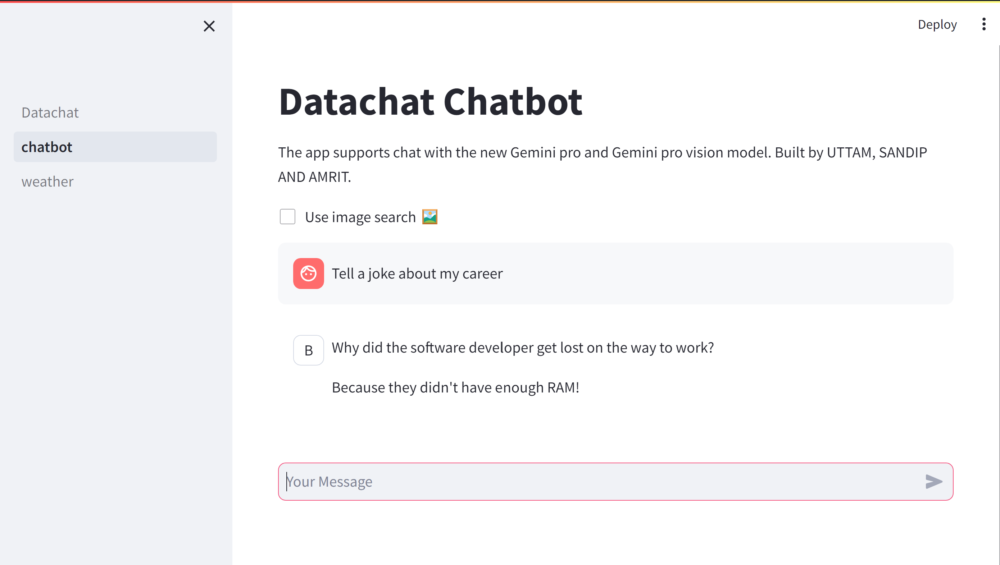

<h1>DataChat</h1>
Datachat is an interactive web application designed to simplify data preprocessing, exploration, and analysis by combining powerful data profiling and chatbot-driven insights. It helps users understand their datasets quickly and generate meaningful visual reports without deep coding knowledge.

<h1>Features</h1>
Data Upload: Upload CSV files easily to start exploring your data.
Automated Data Profiling: Generate detailed data reports using Pandas Profiling.
Interactive Chatbot: Ask questions about your data and get insightful responses powered by AI.
Image Data Analysis: Supports computer vision-based analysis of images.
User-Friendly Interface: Built with Streamlit for easy, no-code interaction.
Multi-modal Data Handling: Works with tabular and image data seamlessly.

#Tech Stack
Backend & Frontend: Streamlit
Data Profiling: Pandas Profiling
AI Chatbot: Gemini API integration
Data Handling: Pandas, NumPy
Image Analysis: Computer Vision techniques integrated with AI

#Usage
Upload your dataset in CSV format.

View the detailed profiling report generated automatically.

Use the chatbot panel to ask questions like:
"Show me the summary statistics."
"What are the missing values?"
"Plot the correlation heatmap."

For image datasets, upload images and query the AI-powered vision model.

